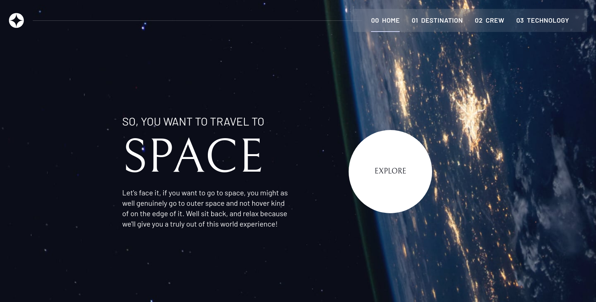
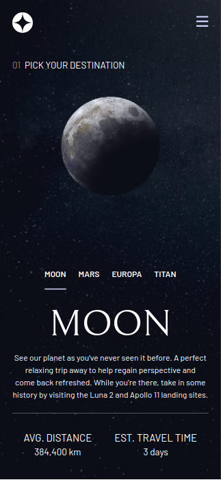

# Frontend Mentor - Space tourism website solution

- Live Site URL: [live site URL]()

Space tourism website solution

This is a solution to the [Space tourism website challenge on Frontend Mentor](https://www.frontendmentor.io/challenges/space-tourism-multipage-website-gRWj1URZ3).

## Table of contents

- [Overview](#overview)
  - [Features](#Features)
  - [Screenshot](#screenshot)
- [My process](#my-process)
  - [Built with](#built-with)
- [Author](#author)

## Overview

### Features

Users should be able to:

- View the optimal layout for each of the website's pages depending on their device's screen size
- See hover states for all interactive elements on the page
- View each page and be able to toggle between the tabs to see new information

### Screenshot

### Built with

- ReactJS
- TypeScript
- React-router-dom
- TailwindCss

## Author

- Github - [Ahmed Lebda](https://github.com/AhmedLebda)
- Frontend Mentor - [Ahmed Lebda](https://www.frontendmentor.io/profile/AhmedLebda)
